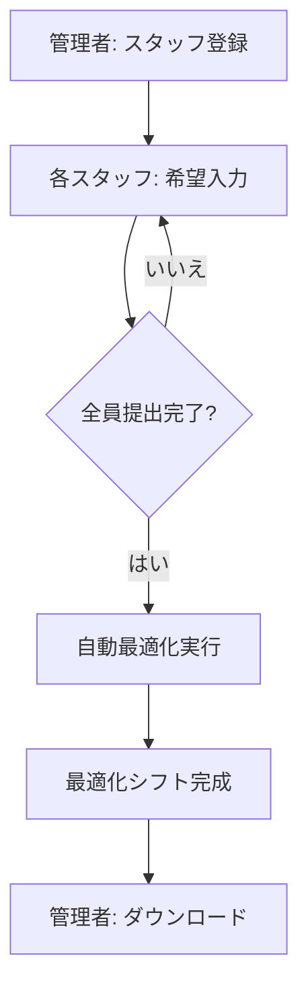

# 📘 シフト自動作成システム 使い方マニュアル

**オルソフィット星田店様専用**

---

## 🌐 アクセス方法

このシステムは Render でデプロイされており、インターネット経由でどこからでもアクセスできます。

### アクセス URL

```
https://simple-shift-app-XXXX.onrender.com
```

> **注意**: 初回アクセス時、15 分以上使用されていなかった場合は起動に 30 秒〜1 分程度かかります。これは無料プランの仕様です。

### 推奨環境

- **ブラウザ**: Chrome、Firefox、Safari、Edge（最新版）
- **デバイス**: スマートフォン、タブレット、PC すべて対応
- **インターネット接続**: 必須

---

## 📋 システムの流れ



---

## 👥 利用者別ガイド

### 🔧 管理者の方へ

#### 1️⃣ 初回設定: スタッフ登録

**いつ**: 毎月 1 回、新しい月のシフトを作成する前

**手順**:

1. トップページにアクセス
2. 「初回設定（スタッフ登録）」をクリック
3. スタッフ名を入力
   - 最低 1 名、推奨 2 名以上
   - 「スタッフを追加」ボタンで入力欄を増やせます
4. 「登録完了」をクリック

![スタッフ登録画面のイメージ]

**完了後**:

- 現在の月（例: 2025 年 11 月）のシフトが作成されます
- スタッフが希望を入力できるようになります

---

#### 2️⃣ スタッフの追加・削除

**いつ**: スタッフの入退職があった場合

**手順**:

1. トップページの「スタッフ管理」をクリック
2. **追加する場合**:
   - スタッフ名を入力
   - 「追加」をクリック
3. **削除する場合**:
   - 削除したいスタッフの「削除」ボタンをクリック
   - 確認メッセージで「OK」

> **注意**: 最低 1 名のスタッフが必要です

---

#### 3️⃣ 提出状況の確認

**いつ**: スタッフが希望を入力している期間中

**手順**:

1. トップページにアクセス
2. 「提出状況」セクションを確認
   - ✅ **提出済み**: 緑色のチェックマーク
   - ❌ **未提出**: 赤色のバツマーク

**表示例**:

```
📊 提出状況（3/5人提出済み）

✅ 山田太郎 - 提出済み
✅ 佐藤花子 - 提出済み
❌ 田中一郎 - 未提出
✅ 鈴木次郎 - 提出済み
❌ 高橋美咲 - 未提出
```

---

#### 4️⃣ シフトのダウンロード

**いつ**: 全員提出完了後、自動最適化が完了したら

**手順**:

1. トップページにアクセス
2. 「✅ シフト最適化完了」のメッセージを確認
3. 「最適化シフトをダウンロード」ボタンをクリック
4. Excel ファイルがダウンロードされます

**ファイル名**: `2025年11月_最適化シフト.xlsx`

**ファイル内容**:

- 各スタッフの 1 ヶ月分のシフト
- 早番・遅番・休みなどが自動的に割り当てられています

---

### 👤 スタッフの方へ

#### 1️⃣ 希望シフトの入力

**いつ**: 管理者がスタッフ登録を完了した後

**手順**:

1. トップページにアクセス
2. 自分の名前をクリック

   ![スタッフ選択画面]

3. 希望入力フォームが表示されます
4. 各日付の希望を選択

   - **早番**: 早い時間帯の勤務希望
   - **中番**: 中間の時間帯の勤務希望
   - **遅番**: 遅い時間帯の勤務希望
   - **休み**: 休日希望
   - **有給**: 有給休暇
   - **半休**: 半日休暇

5. 「希望を提出」ボタンをクリック

---

#### 2️⃣ 便利な一括設定機能

希望入力画面には、効率的に入力できる機能があります：

**シフトタイプを選択して一括適用**:

1. 希望するシフトタイプを選択（例: 早番）
2. 適用範囲を選択:
   - **全日に適用**: 全ての日に適用
   - **平日に適用**: 月〜金曜日のみ適用
   - **土日に適用**: 土日のみ適用

**使用例**:

```
「基本的に早番希望だけど、土日は休みたい」
→ 1. 「早番」を選択して「全日に適用」
   2. 「休み」を選択して「土日に適用」
```

---

#### 3️⃣ 希望の修正

**提出後でも修正可能です！**

**手順**:

1. トップページにアクセス
2. 自分の名前をクリック
3. 前回の希望が表示されます
4. 修正したい日付を変更
5. 「希望を提出」ボタンをクリック

> **注意**: 全員提出完了後、自動最適化が実行されると修正できなくなります

---

## 🤖 自動最適化について

### 最適化のタイミング

**全員が希望を提出した瞬間**に自動的に実行されます！

管理者が手動で実行する必要はありません。

### 最適化の制約条件

システムは以下のルールに従ってシフトを作成します：

| 制約項目           | 内容                              |
| ------------------ | --------------------------------- |
| **毎日の必要人数** | 早番・遅番それぞれ最低 1 名       |
| **連続勤務制限**   | 遅番 → 翌日早番の連続は禁止       |
| **休日数**         | 各スタッフ 9〜11 日（目標 10 日） |
| **希望の尊重**     | できる限りスタッフの希望に沿う    |

### 最適化が失敗する場合

以下の場合、最適化が失敗する可能性があります：

❌ **全員が同じ日に休み希望**

```
解決策: 休み希望を分散させる
```

❌ **スタッフ数が少なすぎる**（1 名のみなど）

```
解決策: 最低2名以上のスタッフを登録
```

❌ **希望が厳しすぎる**（ほとんど全日休み希望など）

```
解決策: 希望を調整する
```

**失敗時の対応**:

1. エラーメッセージを確認
2. スタッフに希望の調整を依頼
3. 再度提出してもらう

---

## 📱 スマートフォンでの使い方

### iPhone の場合

1. Safari でアクセス
2. 画面下部の「共有」ボタンをタップ
3. 「ホーム画面に追加」を選択
4. アプリのようにアクセスできます

### Android の場合

1. Chrome でアクセス
2. 右上のメニュー（⋮）をタップ
3. 「ホーム画面に追加」を選択
4. アプリのようにアクセスできます

---

## 🔐 セキュリティとプライバシー

### データの保存場所

- すべてのデータは Render のサーバーに保存されます
- Excel ファイルは`output/`ディレクトリに保存

### 注意事項

⚠️ **重要**: Render の無料プランでは、サーバーが再起動されるとファイルが消える可能性があります。

**対策**:

1. 最適化シフトは必ずダウンロードして保存
2. 重要なデータは定期的にバックアップ

---

## ❓ よくある質問（FAQ）

### Q1: アクセスしたら「Starting...」と表示される

**A**: 15 分以上使用されていなかった場合、サーバーがスリープ状態になっています。30 秒〜1 分待つと起動します。

---

### Q2: 希望を提出したのに反映されない

**A**: 以下を確認してください：

1. 「希望を提出」ボタンをクリックしたか
2. 「提出完了」のメッセージが表示されたか
3. ブラウザをリロードしてみる

---

### Q3: 最適化シフトがダウンロードできない

**A**: 以下を確認してください：

1. 全員が提出完了しているか
2. 自動最適化が完了しているか（「✅ シフト最適化完了」のメッセージ）
3. ブラウザのポップアップブロックを確認

---

### Q4: スタッフ名を間違えて登録してしまった

**A**:

1. 「スタッフ管理」から削除
2. 正しい名前で再登録

---

### Q5: 前月のシフトを参照したい

**A**: 現在のバージョンでは、毎月新しくシフトを作成します。前月の Excel ファイルを手元に保存しておいてください。

---

## 🆘 トラブルシューティング

### 問題: ページが表示されない

**原因**: インターネット接続の問題、またはサーバーの問題

**解決策**:

1. インターネット接続を確認
2. 別のブラウザで試す
3. 数分待ってから再度アクセス
4. Render のステータスページを確認: https://status.render.com/

---

### 問題: 「エラーが発生しました」と表示される

**原因**: システムエラー

**解決策**:

1. エラーメッセージをスクリーンショット
2. ブラウザをリロード
3. 管理者に連絡

---

### 問題: Excel ファイルが開けない

**原因**: ファイルが破損している、または互換性の問題

**解決策**:

1. 最新の Microsoft Excel を使用
2. Google スプレッドシートで開いてみる
3. LibreOffice Calc で開いてみる

---

## 📞 サポート

### 問題が解決しない場合

管理者に以下の情報を提供してください：

1. **いつ**: 問題が発生した日時
2. **何をした**: 実行した操作
3. **エラーメッセージ**: 表示されたメッセージ（スクリーンショット推奨）
4. **使用環境**: デバイス（iPhone、Android、PC）、ブラウザ

---

## 🎯 ベストプラクティス

### 管理者向け

✅ **月初めにスタッフ登録を完了**
✅ **提出期限を設定**（例: 毎月 25 日まで）
✅ **提出状況を定期的に確認**
✅ **最適化シフトは必ずダウンロードして保存**

### スタッフ向け

✅ **期限内に提出**
✅ **現実的な希望を入力**（全日休みは避ける）
✅ **提出後、確認メッセージを確認**
✅ **変更がある場合は早めに修正**

---

## 📊 シフトタイプの説明

| シフトタイプ | 説明               | 使用例                 |
| ------------ | ------------------ | ---------------------- |
| **早番**     | 早い時間帯の勤務   | 開店準備、午前中の業務 |
| **中番**     | 中間の時間帯の勤務 | 昼間の業務             |
| **遅番**     | 遅い時間帯の勤務   | 夕方〜閉店業務         |
| **休み**     | 休日               | 完全休日               |
| **有給**     | 有給休暇           | 有給消化               |
| **半休**     | 半日休暇           | 午前休、午後休         |

---

## 🔄 月次運用フロー

### 推奨スケジュール

```
毎月1日: 管理者がスタッフ登録
↓
毎月1日〜25日: スタッフが希望入力
↓
毎月25日: 提出期限
↓
全員提出完了: 自動最適化実行
↓
管理者がダウンロード・確認
↓
翌月1日: 新しいシフト開始
```

---

## 📈 システムの制限事項

### Render 無料プランの制限

| 項目         | 制限内容                        |
| ------------ | ------------------------------- |
| **スリープ** | 15 分間アクセスがないとスリープ |
| **起動時間** | スリープ後の起動に 30 秒〜1 分  |
| **ディスク** | 一時的（再起動で消える可能性）  |
| **帯域幅**   | 月 100GB まで                   |

### システムの推奨利用規模

- **スタッフ数**: 2〜20 名程度
- **同時アクセス**: 10 名程度まで
- **月次利用**: 問題なし

---

## 🎓 用語集

| 用語         | 説明                                                 |
| ------------ | ---------------------------------------------------- |
| **デプロイ** | システムをインターネット上に公開すること             |
| **Render**   | このシステムが動いているクラウドサービス             |
| **最適化**   | 制約条件を満たしながら最適なシフトを自動生成すること |
| **スリープ** | サーバーが一時的に停止している状態                   |

---

## 📝 更新履歴

| バージョン | 日付          | 内容                         |
| ---------- | ------------- | ---------------------------- |
| 2.0.0      | 2024 年 11 月 | 個別入力・自動最適化機能追加 |
| 2.1.0      | 2025 年 11 月 | Render デプロイ対応          |

---

## 📄 ライセンスと著作権

**オルソフィット星田店様専用システム**

このシステムは、オルソフィット星田店様のシフト管理業務を効率化するために開発されました。

---

**マニュアル作成日**: 2025 年 11 月 26 日  
**バージョン**: 2.1.0  
**対象システム**: シフト自動作成システム（Render 版）
